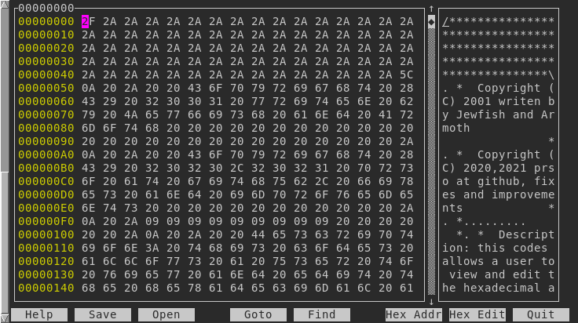

hexcurse-ng
=====================================

**New release [v1.70.0](https://github.com/prso/hexcurse-ng/releases/tag/v1.70.0)**

Project: https://github.com/prso/hexcurse-ng



This is a fork from [LonnyGomes/hexcurse](https://github.com/LonnyGomes/hexcurse) with fixes and improvements.

Description
-----------
Hexcurse is a curses-based hex editing utility that can open, edit, and save
files and block devices, editing both the hexadecimal and decimal values.

It was written by Lonny Gomes and James Stephenson but they haven't
maintained it for some time.

It currently supports fast searching, hex and decimal address output,
jumping to specified locations in the file, "undo" capabilities, "bolded"
modifications, colors, EBCDIC mode, and quick keyboard shortcuts to
commands.


Requirements
------------
You must have the ncurses development libraries (version 5+) to compile this program


Installation
------------

    ./configure
    make
    make install

Usage
-----

    usage: hexcurse [-?|help] [-a] [-c colorlevel] [-e] [-f] [-o outputfile] [-r rnum] [-t] [[-i] infile]

        -? | -help    Display usage and version of hexcurse program
        -a            Output addresses in decimal format initially
        -c colorlevel Set the color level:
                        0: no colors
                        1: only color for addresses
                        2: 1 + color for 00 (default if terminal supports color)
                        3: multicolor by FrankSansC
        -e            Output characters in EBCDIC format rather than ASCII
        -f            Show function key numbers in labels
        -o outfile    Write output to outfile by default
        -r rnum       Resize the display to "rnum" bytes wide
        -t            Keep colors defined by terminal
        [-i] infile   Read from data from infile (-i required if not last argument)

#### Keyboard shortcuts

```
│ CTRL+?    Help     - help screen
│ CTRL+S    Save     - saves the current file open
│ CTRL+O    Open     - opens a new file
│ CTRL+G    Goto     - goto a specified address
│ CTRL+F    Find     - search for a hex/ascii value
│ CTRL+A    HexAdres - toggle between hex/decimal address
│ TAB       Hex Edit - toggle between hex/ASCII windows
│ CTRL+Q    Quit     - exit out of the program
│ CTRL+U    Page up  - scrolls one screen up
│ CTRL+D    Page down- scrolls one screen down
│ CTRL+Z    Undo     - reverts last modification
│ CTRL+T    Home     - returns to the top of the file
│ CTRL+B    End      - jumps to the bottom of the file
```
